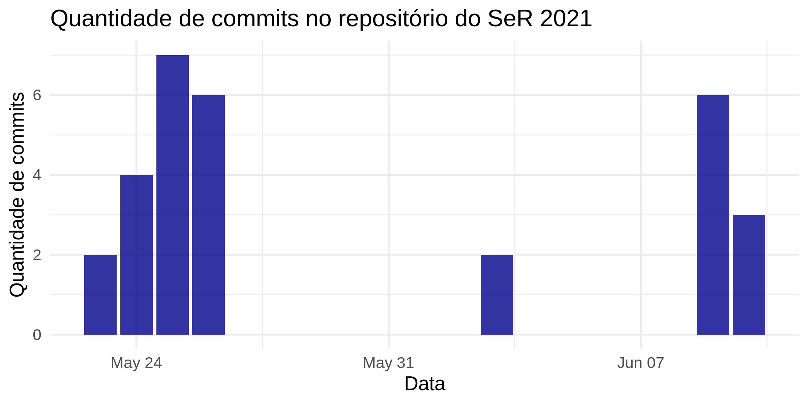

<!-- README.md is generated from README.Rmd. Please edit that file -->

# ser2021

<!-- badges: start -->
<!-- badges: end -->

``` r
library(magrittr)
library(gh)
library(purrr)
library(tibble)
library(ggplot2)
library(lubridate)
```

``` r
gh("/repos/eventoseroficial/Data_and_Code/commits") %>% 
  map_chr(pluck, "commit", "committer", "date") %>% 
  ymd_hms() %>% 
  floor_date("day") %>% 
  as.Date() %>% 
  enframe() %>% 
  ggplot(aes(value)) +
  geom_bar(fill = "darkblue", alpha = .8) +
  theme_minimal(14) +
  labs(
    x = "Data", 
    y = "Quantidade de commits",
    title = "Quantidade de commits no repositório do SeR 2021"
  )
```


